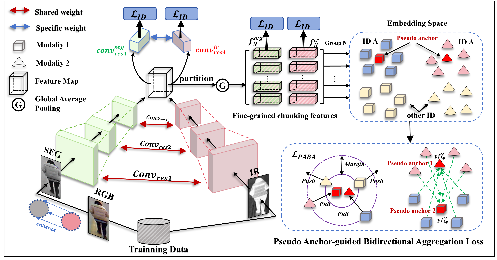

## SEPG-Net
A Simple yet effective architecture for VI-ReID. No need for fancy, complicated methods.

[Yiyuan Ge](https://scholar.google.com/citations?user=qKxpHGcAAAAJ&hl=zh-CN), [Zhihao Chen](https://scholar.google.com/citations?user=SBoHvVQAAAAJ&hl=zh-CN), [Ziyang Wang](https://scholar.google.com/citations?hl=en&user=GWF20_wAAAAJ)

## :fire: NEWS :fire:

- [09/2024] **📣We submitted our paper to ICASSP 2025**
  
- [08/2024] **📣We released the code.**

## Demo Picture



## Installation

Run `pip install -r requirements.txt` in the root directory of the project.

## Training

1.
The RegDB and SYSU-MM01 datasets are publicly available, which can be find at [Paper 1](https://scholar.google.com.hk/scholar?hl=zh-CN&as_sdt=0%2C5&q=+RGB-infrared+cross-modality+person+re-identification&btnG=) and [Paper 2](https://scholar.google.com.hk/scholar?hl=zh-CN&as_sdt=0%2C5&q=Person+recognition+system+based+on+a+combination+of+body+images+from+visible+light+and+thermal+cameras&btnG=)

2.
change the data_path in code/train_row.py (line 60 and 64)

3.
```
python train_row.py --gpu 0 --dataset sysu
```
